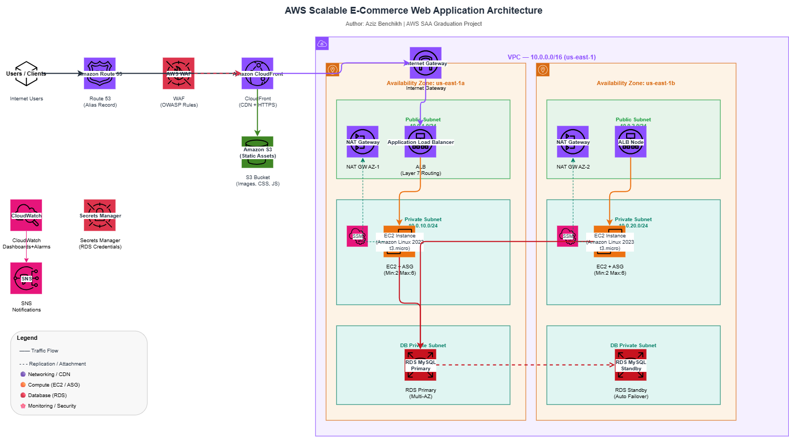

# 🛍️ Scalable E-Commerce Web Application on AWS

> **AWS Solutions Architect – Associate | Graduation Project**
> **Author**: Aziz Benchikh | [benchikhaziz11@gmail.com](mailto:benchikhaziz11@gmail.com) | [LinkedIn](https://www.linkedin.com/in/aziz-benchikh)

---

## 📋 Project Overview

This project implements a **production-grade, highly available e-commerce product catalog** deployed on AWS using a multi-tier architecture. The solution is designed to demonstrate mastery of core AWS services tested in the **SAA-C03 certification exam**, including VPC design, EC2 with Auto Scaling, Application Load Balancing, CloudFront CDN, RDS Multi-AZ, and security best practices.

The architecture achieves:
- ⚡ **High Availability** — resources span 2 Availability Zones with no single point of failure
- 📈 **Elasticity** — Auto Scaling Group adjusts capacity from 2 to 6 EC2 instances based on load
- 🔒 **Security** — defense-in-depth with WAF, private subnets, Security Groups, KMS encryption, and Secrets Manager
- 🌍 **Performance** — CloudFront CDN caches static assets globally; multi-AZ RDS with automated failover
- 💰 **Cost Optimization** — ASG scale-in during off-peak, S3 Intelligent Tiering, CloudFront reducing backend load

---

## 🏗️ Architecture Diagram



> 📐 **Edit the diagram**: Open [draw.io](https://app.diagrams.net/) → **File → Open** `architecture/Architecture.drawio.png` 

### Architecture Flow

```
Users
  │
  ▼
Amazon Route 53 (Alias record → CloudFront)
  │
  ▼
AWS WAF ──── attached to ────► Amazon CloudFront (CDN + TLS termination)
                                    │                    │
                                    ▼                    ▼
                              ALB (Dynamic)        S3 Bucket (Static assets)
                              /api/* routes        /static/* routes
                                    │
                         ┌──────────┴──────────┐
                         │                     │
                    ┌────▼─────┐         ┌─────▼────┐
                    │ Public   │         │ Public   │
                    │Subnet AZ1│         │Subnet AZ2│
                    │ (ALB node│         │ (ALB node│
                    │ NAT GW)  │         │ NAT GW)  │
                    └────┬─────┘         └────┬─────┘
                         │                    │
                    ┌────▼─────┐         ┌────▼─────┐
                    │ Private  │         │ Private  │
                    │Subnet AZ1│         │Subnet AZ2│
                    │  EC2 ×N  │◄──ASG──►│  EC2 ×N  │
                    │  Nginx   │         │  Nginx   │
                    └────┬─────┘         └────┬─────┘
                         │                    │
                    ┌────▼─────┐         ┌────▼─────┐
                    │ DB Sub   │         │ DB Sub   │
                    │Subnet AZ1│         │Subnet AZ2│
                    │RDS Primary│◄─sync─►│RDS Standby│
                    └──────────┘         └──────────┘

Supporting services: CloudWatch + SNS | SSM Session Manager | Secrets Manager | KMS
```

---

## 🔧 AWS Services Used

### Networking
| Service | Purpose |
|---------|---------|
| **Amazon VPC** | Isolated network with public (10.0.1-2.0/24) and private subnets (10.0.10-40.0/24) across 2 AZs |
| **Internet Gateway** | Enables inbound/outbound internet for public subnets |
| **NAT Gateway (×2)** | One per AZ — allows private EC2 instances to reach the internet without being exposed |
| **Security Groups** | Stateful firewall rules: ALB → EC2 → RDS chain (least privilege) |
| **Route Tables** | Public subnets route to IGW; private subnets route to NAT GW |

### Content Delivery & Edge
| Service | Purpose |
|---------|---------|
| **Amazon CloudFront** | CDN distribution — two origins: S3 (static) + ALB (dynamic). Enforces HTTPS, TLS 1.2+ |
| **AWS WAF** | Web Application Firewall attached to CloudFront — OWASP managed rule set, rate limiting |
| **Amazon Route 53** | DNS management with Alias record pointing to CloudFront distribution |
| **S3 (Static Assets)** | Hosts product images, CSS, JS. Accessed only via CloudFront OAC (not public) |

### Compute
| Service | Purpose |
|---------|---------|
| **EC2 + Launch Template** | Amazon Linux 2023, t3.micro, IMDSv2 enforced, encrypted EBS, Nginx web server |
| **Application Load Balancer** | Layer 7 load balancer in public subnets. Distributes traffic to EC2 target group |
| **Auto Scaling Group** | Min: 2, Desired: 2, Max: 6 instances. Target tracking CPU @ 60% + ALB request count |
| **Systems Manager** | Session Manager for secure shell access — no SSH, no bastion host required |

### Database
| Service | Purpose |
|---------|---------|
| **Amazon RDS MySQL 8.0** | Multi-AZ deployment with automatic failover to standby in second AZ (<2 min RTO) |
| **KMS (CMK)** | Customer-managed encryption key for RDS, EBS volumes — annual key rotation |
| **Secrets Manager** | Auto-generates strong RDS password; EC2 retrieves it at runtime via IAM role |

### Monitoring
| Service | Purpose |
|---------|---------|
| **Amazon CloudWatch** | 7 alarms: CPU, unhealthy hosts, latency (p95), 5xx errors, RDS connections, storage, ASG size |
| **CloudWatch Dashboard** | Executive overview: request rate, latency, healthy hosts, DB connections, instance count |
| **Amazon SNS** | Email notifications when any alarm transitions to ALARM or OK state |
| **CloudWatch Logs** | Nginx access/error logs and RDS slow query logs shipped via CloudWatch agent |

---

## 📁 Repository Structure

```
aws-scalable-ecommerce/
│
├── README.md                          ← This file — main documentation
│
├── architecture/
│   └── Architecture.drawio.png       ← Architecture diagram 
│
├── cloudformation/
│   ├── main-stack.yaml                ← Root stack (deploys all nested stacks)
│   ├── network-stack.yaml             ← VPC, subnets, IGW, NAT GWs, route tables
│   ├── security-stack.yaml            ← Security Groups, VPC endpoints for SSM
│   ├── compute-stack.yaml             ← Launch Template, ASG, ALB, scaling policies
│   ├── database-stack.yaml            ← RDS MySQL Multi-AZ, KMS key, Secrets Manager
│   ├── cdn-stack.yaml                 ← CloudFront, S3 static assets, OAC, WAF
│   └── monitoring-stack.yaml          ← CloudWatch alarms, dashboard, SNS topic
│
├── app/
│   └── userdata.sh                    ← EC2 bootstrap script (Nginx, CloudWatch agent)
│
└── docs/
    ├── deployment-guide.md            ← Step-by-step deployment instructions
    ├── cost-estimate.md               ← Monthly cost breakdown (3 scenarios)
    └── security-checklist.md          ← Security controls mapped to Well-Architected
```

---

## 🚀 Quick Start Deployment

### Prerequisites
- AWS Account with AdministratorAccess
- AWS CLI installed and configured (`aws configure`)
- An S3 bucket to host CloudFormation templates

### Step 1: Upload CloudFormation Templates

```bash
# Create templates bucket
BUCKET="ecommerce-cfn-$(aws sts get-caller-identity --query Account --output text)"
aws s3 mb s3://$BUCKET --region us-east-1

# Upload nested stacks (NOT main-stack.yaml)
aws s3 cp cloudformation/ s3://$BUCKET/ \
  --recursive --exclude "main-stack.yaml"
```

### Step 2: Deploy the Stack

```bash
aws cloudformation create-stack \
  --stack-name EcommerceApp \
  --template-body file://cloudformation/main-stack.yaml \
  --parameters \
    ParameterKey=EnvironmentName,ParameterValue=EcommerceApp \
    ParameterKey=TemplatesBucketName,ParameterValue=$BUCKET \
    ParameterKey=AlertEmail,ParameterValue=YOUR_EMAIL@example.com \
  --capabilities CAPABILITY_IAM CAPABILITY_NAMED_IAM \
  --region us-east-1
```

⏱️ **Deployment time**: ~30-40 minutes (RDS Multi-AZ takes the longest)

### Step 3: Get Your Website URL

```bash
aws cloudformation describe-stacks \
  --stack-name EcommerceApp \
  --query "Stacks[0].Outputs[?OutputKey=='WebsiteURL'].OutputValue" \
  --output text
```

📖 **Full deployment guide**: [docs/deployment-guide.md](docs/deployment-guide.md)

---

## 🔒 Security Architecture

The architecture implements **defense-in-depth** across multiple layers:

```
Layer 1 (Edge):     CloudFront + WAF (OWASP Top 10 rules, rate limiting)
Layer 2 (TLS):      HTTPS-only (TLS 1.2+), HSTS, security response headers
Layer 3 (Network):  ALB in public subnets; EC2 + RDS in private subnets only
Layer 4 (Access):   Security Group chaining — no open ports from internet
Layer 5 (Identity): EC2 IAM Role (no access keys); SSM Session Manager (no SSH)
Layer 6 (Data):     KMS CMK encryption (RDS, EBS); Secrets Manager (no passwords in code)
Layer 7 (Monitor):  CloudWatch alarms; SNS alerts; CloudTrail (recommended)
```

📋 **Full security checklist**: [docs/security-checklist.md](docs/security-checklist.md)

---

## 💰 Cost Estimate

| Scenario | Configuration | Est. Monthly Cost |
|----------|--------------|------------------|
| **Demo Mode** | 2× t3.micro, Single-AZ RDS, 1 NAT GW | ~$63/month |
| **Best Practice** | 2× t3.micro, Multi-AZ RDS, 2 NAT GWs | ~$163/month |
| **Production Scale** | 6× t3.medium, r6g.large RDS | ~$856/month |

> [!TIP]
> For project demonstration, deploy for **2-4 hours** and delete the stack. Cost is typically < $5 for a short-lived demo.

📊 **Full cost breakdown**: [docs/cost-estimate.md](docs/cost-estimate.md)

---

## 📚 Learning Outcomes

This project directly addresses **all SAA-C03 exam domains**:

### Domain 1: Design Resilient Architectures
- ✅ Multi-AZ VPC design with public and private subnets
- ✅ RDS Multi-AZ with automatic failover (RPO ~seconds, RTO <2 min)
- ✅ ALB health checks detect and remove unhealthy instances automatically
- ✅ Auto Scaling Group ensures minimum capacity is always maintained

### Domain 2: Design High-Performing Architectures
- ✅ CloudFront reduces latency by caching assets at 450+ edge locations
- ✅ Target tracking scaling policy responds to CPU and request count
- ✅ S3 as static asset origin — offloads EC2 for images, CSS, JS
- ✅ ALB connection draining (deregistration delay) for smooth scale-in

### Domain 3: Design Secure Applications and Architectures
- ✅ WAF protects against SQL injection, XSS, and volumetric attacks
- ✅ All compute and databases in private subnets — not internet-accessible
- ✅ KMS Customer-Managed Key for encryption at rest (RDS + EBS)
- ✅ Secrets Manager eliminates hardcoded credentials — zero secrets in code
- ✅ SSM Session Manager replaces bastion hosts entirely
- ✅ IMDSv2 enforced to prevent SSRF attacks against instance metadata

### Domain 4: Design Cost-Optimized Architectures
- ✅ Auto Scaling scales in during low-traffic periods (2 min instances minimum)
- ✅ CloudFront reduces ALB + EC2 costs by serving cached content
- ✅ S3 Lifecycle policies transition old assets to STANDARD_IA and GLACIER
- ✅ gp3 storage type chosen over gp2 (20% cheaper, better baseline IOPS)

---

## 🧪 Testing the Architecture

### Verify High Availability

```bash
# Check instances are deployed across both AZs
aws autoscaling describe-auto-scaling-groups \
  --auto-scaling-group-names EcommerceApp-ASG \
  --query "AutoScalingGroups[0].Instances[*].{ID:InstanceId,AZ:AvailabilityZone}"
```

### Connect Without SSH (SSM Session Manager)

```bash
# Get an instance ID
INSTANCE=$(aws autoscaling describe-auto-scaling-groups \
  --auto-scaling-group-names EcommerceApp-ASG \
  --query "AutoScalingGroups[0].Instances[0].InstanceId" --output text)

# Open a session (no SSH key, no bastion needed!)
aws ssm start-session --target $INSTANCE
```

### Simulate Auto Scaling

```bash
# SSH into instance via SSM and stress the CPU
stress --cpu 4 --timeout 300    # Requires: sudo dnf install -y stress
# Watch ASG scale out in CloudWatch or ASG console
```

### Health Check

```bash
ALB=$(aws cloudformation describe-stacks --stack-name EcommerceApp \
  --query "Stacks[0].Outputs[?OutputKey=='ALBDirectURL'].OutputValue" --output text)
curl $ALB/health   # Returns: healthy
```

---

## 🗑️ Cleanup

```bash
# Delete all resources (RDS snapshot created automatically)
aws cloudformation delete-stack --stack-name EcommerceApp --region us-east-1

# Clean up the templates bucket
aws s3 rb s3://$BUCKET --force
```

---

## 📖 References

- [AWS Well-Architected Framework](https://docs.aws.amazon.com/wellarchitected/latest/framework/welcome.html)
- [AWS VPC Documentation](https://docs.aws.amazon.com/vpc/latest/userguide/)
- [Amazon EC2 Auto Scaling](https://docs.aws.amazon.com/autoscaling/ec2/userguide/)
- [Amazon RDS Multi-AZ](https://docs.aws.amazon.com/AmazonRDS/latest/UserGuide/Concepts.MultiAZ.html)
- [Amazon CloudFront](https://docs.aws.amazon.com/AmazonCloudFront/latest/DeveloperGuide/)
- [AWS WAF Developer Guide](https://docs.aws.amazon.com/waf/latest/developerguide/)
- [AWS Secrets Manager](https://docs.aws.amazon.com/secretsmanager/latest/userguide/)
- [AWS Systems Manager Session Manager](https://docs.aws.amazon.com/systems-manager/latest/userguide/session-manager.html)

---

## 👤 Author

**Aziz Benchikh**
- 📧 Email: [benchikhaziz11@gmail.com](mailto:benchikhaziz11@gmail.com)
- 💼 LinkedIn: [Aziz Ben Chikh](https://www.linkedin.com/in/aziz-benchikh)
- 🎓 Program: AWS Solutions Architect – Associate (SAA-C03)

---

*This project was created as part of the AWS Solutions Architect – Associate graduation requirements at Manara.*
